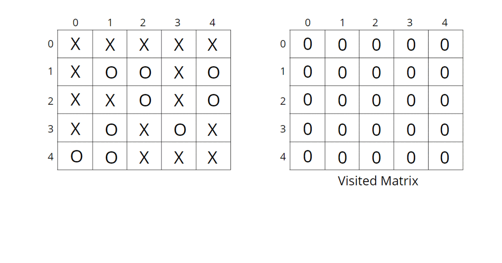
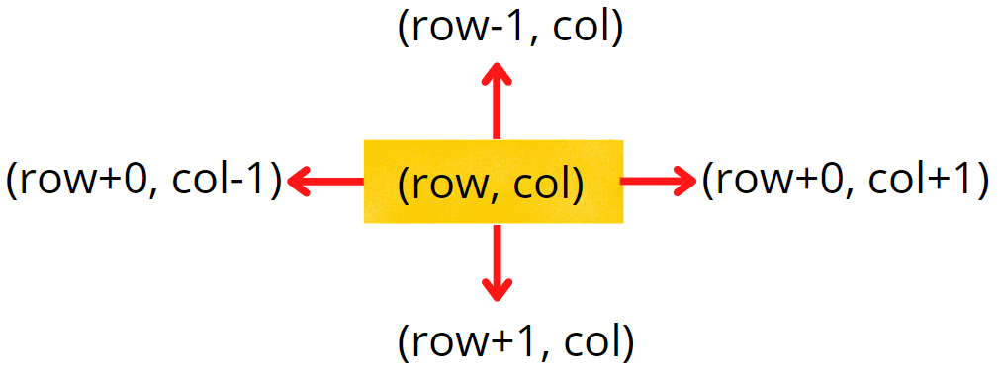

## Surrounded Regions | Replace O’s with X’s

[visit problem](https://practice.geeksforgeeks.org/problems/replace-os-with-xs0052/1)

**Intuition :** 
The boundary elements in the matrix cannot be replaced with ‘X’ as they are not surrounded by ‘X’ from all 4 directions. This means if `‘O’ (or a set of ‘O’)` is connected to a boundary ‘O’ then it can’t be replaced with ‘X’.  

The intuition is that we start from boundary elements having ‘O’ and go through its neighboring Os in 4 directions and mark them as visited to avoid replacing them with ‘X’.  

**Approach :** 
We can follow either of the traversal techniques as long as we are starting with a boundary element and marking all those Os connected to it. We will be solving it using DFS traversal, but you can apply BFS traversal as well.    

DFS is a traversal technique that involves the idea of recursion.. DFS goes in-depth, i.e., traverses all nodes by going ahead, and when there are no further nodes to traverse in the current path, then it backtracks on the same path and traverses other unvisited nodes. 

The algorithm steps are as follows:  

-   Create a corresponding visited matrix and initialize it to 0.
-   Start with boundary elements, once ‘O’ is found, call the DFS function for that element and mark it as visited. In order to traverse for boundary elements, you can traverse through the first row, last row, first column, and last column.
-   DFS function call will run through all the unvisited neighboring ‘O’s in all 4 directions and mark them as visited so that they are not converted to ‘X’ in the future. The DFS function will not be called for the already visited elements to save time, as they have already been traversed.
-   When all the boundaries are traversed and corresponding sets of ‘O’s are marked as visited, they cannot be replaced with ‘X’. All the other remaining unvisited ‘O’s are replaced with ‘X’. This can be done in the same input matrix as the problem talks about replacing the values, otherwise tampering with data is not advised.

Consider the following illustration to understand how DFS traverses the matrix and replaces O’s with X’s.   

 

**How do set boundaries for 4 directions? :** 
The 4 neighbors will have the following indexes:  

 

Now, either we can apply 4 conditions or follow the following method.   

From the above image, it is clear that the delta change in the row is -1, +0, +1, +0. Similarly, the delta change in the column is 0, +1, +0, -1. So we can apply the same logic to find the neighbors of a particular pixel `(<row, column>)`.  

**Complexity Analysis :** 

-   Time-Complexity: `O(N) + O(M) + O(NxMx4) ~ O(N x M)`, For the worst case, every element will be marked as ‘O’ in the matrix, and the DFS function will be called for `(N x M)` nodes and for every node, we are traversing for 4 neighbors, so it will take `O(N x M x 4)` time. Also, we are running loops for boundary elements so it will take `O(N) + O(M)`.

-   Space-Complexity: `O(N x M), O(N x M)` for the visited array, and auxiliary stack space takes up `N x M` locations at max
