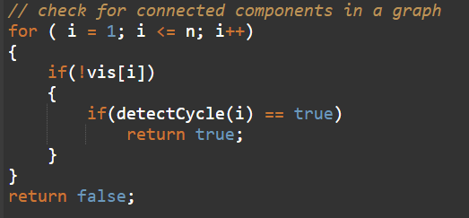
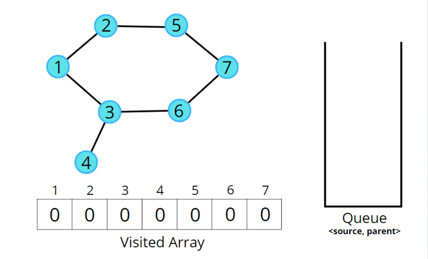

## Detect cycle in an undirected graph

[Visit Problem](https://practice.geeksforgeeks.org/problems/detect-cycle-in-an-undirected-graph/1)

**Approach :** 

-   For BFS traversal, we need a queue data structure and a visited array.
-   Push the pair of the source node and its parent data (<source, parent>) in the queue, and mark the node as visited. The parent will be needed so that we don’t do a backward traversal in the graph, we just move frontwards.
-   tart the BFS traversal, pop out an element from the queue every time and travel to all its unvisited neighbors using an adjacency list
-   Repeat the steps either until the queue becomes empty, or a node appears to be already visited which is not the parent, even though we traveled in different directions during the traversal, indicating there is a cycle
-   If the queue becomes empty and no such node is found then there is no cycle in the graph.

A graph can have connected components as well. In such cases, if any component forms a cycle then the graph is said to have a cycle. We can follow the algorithm for the same: 
 

Consider the following graph and its adjacency list. 
 

Consider the following illustration to understand the process of detecting a cycle using BFS traversal. 
 

**Complexity Analysis :** 

-   Time Complexity: `O(N + 2E) + O(N)`, Where` N = Nodes, 2E` is for total degrees as we traverse all adjacent nodes. In the case of connected components of a graph, it will take another `O(N)` time.

-   Space Complexity: `O(N) + O(N) ~ O(N)`, Space for queue data structure and visited array.

**References :** 

-   [From blog](https://takeuforward.org/data-structure/detect-cycle-in-an-undirected-graph-using-bfs/)
-   [From Video](https://www.youtube.com/watch?v=BPlrALf1LDU&list=PLgUwDviBIf0oE3gA41TKO2H5bHpPd7fzn&index=11)
